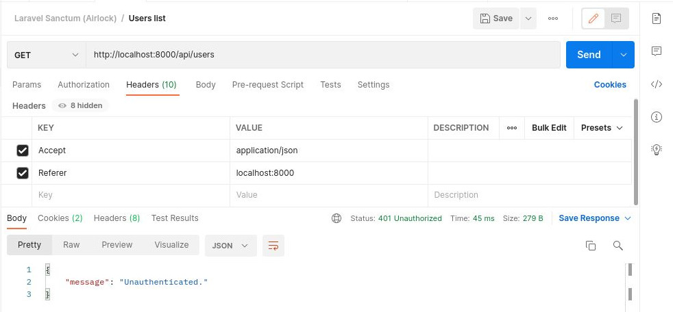

# Laravel Sanctum (Airlock) with Postman

Remember that you are using Laravel as an API. And to test it with Postman, this requires a bit more work than just attaching a token (unless you're using token-based authentication with Sanctum).

If you're building a SPA and want to test your endpoints with cookie-based authentication in Postman, here's how to do it.

## The jist of it

Because Sanctum uses cookie-based authentication and hits CSRF protected endpoints like /login and /logout, we need to make sure we're sending a CSRF token with Postman. We get this by sending a request to /sanctum/csrf-cookie first. We'll also need to make sure the Referrer is properly sent for future requests for Sanctum to allow them.

Estoy probando esto con un proyecto Laravel correctamente configurado con Sanctum, que permite solicitudes de localhost, en términos de dominios CORS y Sanctum.

We're testing this with a [Laravel Project properly configured with Sanctum](../guide/setup-laravel-api.html#), that allows requests from localhost, in terms of both CORS and Sanctum domains.

## Create a Postman Collection

We'd recommend creating a Postman collection so we can apply our pre-request script (in a moment) to all endpoints.


Once the collection is created, this makes it easier to apply a pre-request script to all endpoints under that collection. It also helps keep everything nice and tidy.

## Create an environment

We're going to be setting a CSRF token in our environment variables in Postman, so we need to create a Postman environment.

Click the cog in the top right of Postman, click Add and give your environment a name (mine's `Api-test`). Click Add again and switch to your environment in the top right (see top right of screenshot).


## Add a pre-request script

Before we do some request, create a new request to `/login` in Postman, save it to your collection and add in the form data (email and password). Add an `Accept` header with `application/json` too, so you get back JSON.


No surprise here, we get back a CSRF token mismatch error.

So, let's add that pre-request script to grab the CSRF token using Sanctum, setting the value in our Postman environment variables.

Edit your collection and switch to the Pre-request Scripts tab, and add the following.


Don't type it from the screenshot, copy it from here:

```js
pm.sendRequest({
    url: 'http://localhost:8000/sanctum/csrf-cookie',
    method: 'GET'
}, function (error, response, { cookies }) {
    if (!error) {
        pm.environment.set('xsrf-token', cookies.get('XSRF-TOKEN'))
    }
})
```

Click Update and that'll be saved.

Now make another request to /login. This time, the pre-request script will be run and will set the cookie we get back from the /sanctum/csrf-cookie endpoint into our environment.

Hit the eye icon in the top right to check.


Great, that's our CSRF token value.

Now update the /login request to add the X-XSRF-TOKEN header with the value __{ { xsrf - token } }__ (this is the value of our environment variable), and send the request again.


Make sure you don't include spaces between the curly braces (e.g. __{ { xsrf - token } }__). Postman doesn't like that.

Hopefully that worked for you. If not, you may have to check your Sanctum setup.

## Make authenticated requests

So we've sorted CSRF, now we'll make a request to `/api/users` to verify we're actually authenticated. Create a request for this in Postman and add it to your collection. And of course, send that request.



Hmm, unauthenticated.

Now, this should actually work. Postman has stored the cookies we got back from making the earlier request to /login and will send them along with this request. You can verify this by clicking the cookies link to the top right of your request.


The reason this isn't working is that Sanctum is denying the authenticated request based on the referrer.

If you're interested in diving into some Sanctum code and figuring out why, open up the EnsureFrontendRequestsAreStateful middleware and check out the fromFrontend method that all requests are piped through.

```php
public static function fromFrontend($request)
{
    $referer = Str::replaceFirst('https://', '', $request->headers->get('referer'));

    $referer = Str::replaceFirst('http://', '', $referer);

    return Str::startsWith($referer, config('sanctum.stateful', [])) ||
            Str::is(config('sanctum.stateful', []), $referer);
}
```

It's checking the referrer!

At the moment in Postman, this isn't set, so add it to your headers list and send the request again.


And there you go, a successful request to an authenticated endpoint.

It's best at this point to save your domain in an environment variable in Postman. If this changes and you have a lot of endpoints, this'll be a nightmare to update.

Click the cog in the top right, select your environment and manually add in your host.


--------------------------


Once you've saved that, switch out the header value and send the request again.


Still works. Great.

You'll need to add the Referrer header to all requests you make to your API, if they're protected with Sanctum. That's not too much trouble, though.

## A quick note on other web routes

Sanctum let's us use the normal /login web route to authenticate, but that's not all. We can also hit /logout to invalidate the authenticated cookie value.

For these other web routes (also CSRF protected), you need to ensure you're also sending the token down. Here's a quick example.


My request to /logout was successful because I'm sending down the X-XSRF-TOKEN header, much like we did for /login.

https://blog.codecourse.com/laravel-sanctum-airlock-with-postman/
