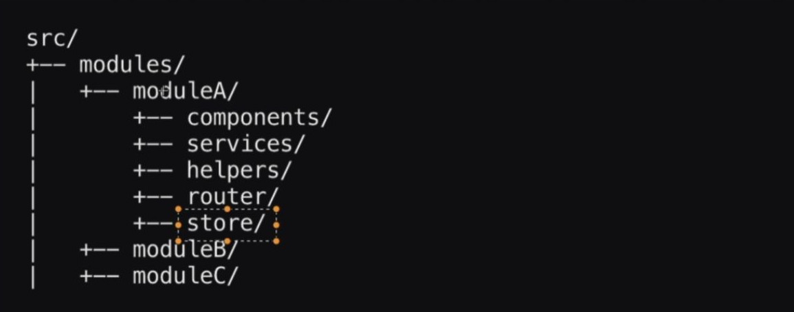

# Usando VueRouter

Una vez instanciado el `router`, este es pasado como complemento global a la aplicación. Puede ver más detalles sobre complementos [aquí](../vue/vue-global-plugins.html).

## `router`

Eche un vistazo al contenido del archivo [src/router/index.ts](https://github.com/CaribesTIC/vue-frontend-ts/blob/main/src/router/index.ts) y luego veámoslo por parte.

## Arquitectura Modular

Un módulo es normalmente un subsistema que proporciona uno o más servicios a otros módulos. Los módulos se componen normalmente de varios componentes del sistema más simples. A su vez éste usa los servicios proporcionados por otros módulos.

>Es más fácil resolver un problema complejo cuando se rompe en piezas manejables.

Entonce, nuestra estructura de carpetas lucirá de esta forma.



Por lo que cada módulo exporta sus propias rutas.

```ts
// omitted for brevity ...
import moduleA from "@/modules/moduleA/routes"
import moduleB from "@/modules/moduleB/routes"
import moduleC from "@/modules/moduleC/routes"
// omitted for brevity ...

const routes: Array<RouteRecordRaw> = [
  ...moduleA.map(route => route),
  ...moduleA.map(route => route),
  ...moduleA.map(route => route),
  // omitted for brevity ...
]
// omitted for brevity ...
```
De esta manera, el archivo [src/router/index.ts](https://github.com/CaribesTIC/vue-frontend-ts/blob/main/src/router/index.ts), mantiene separado por módulos la SPA, con el propósito de que sea lo más ordenada y escalable posible.

Aquí se puede ver un ejemplo de archivo [src/modules/User/routes](https://github.com/CaribesTIC/vue-frontend-ts/blob/main/src/modules/User/routes/index.ts).

```ts
// omitted for brevity ...

export default [{
    path: "/users",
    name: "users",
    meta: { middleware: [auth, admin] },
    component: () => import("@/modules/User/views/Index.vue")      
      .then(m => m.default)
}, {
    path: "/users/create",
    name: "userCreate",
    meta: { middleware: [auth, admin] },
    component: () => import("@/modules/User/views/CreateOrEdit.vue")
      .then(m => m.default),
    props: true
}, {
    path: "/users/edit/:id(\\d+)",
    name: "userEdit",
    meta: { middleware: [auth, admin] },
    component: () => import("@/modules/User/views/CreateOrEdit.vue")
      .then(m => m.default),
    props: true
}]
```

## Routes y Layout

En el componente principal [src/App.vue](https://github.com/CaribesTIC/vue-frontend-ts/blob/main/src/App.vue) se observa cómo funciona el `layout` según el `routes`.

```vue{6,7,8,12,13}
<script setup lang="ts">
import { computed } from "vue"
import { useRouter } from "vue-router"
const defaultLayout = "default"
const { currentRoute } = useRouter()
const layout = computed(
  () => `${currentRoute.value.meta.layout || defaultLayout}-layout`
)
</script>

<template>
  <component :is="layout">
    <router-view v-slot="{Component}">
      <transition name="fade" mode="out-in">
        <component :is="Component" :key="$route.path"></component>
      </transition>
    </router-view>
  </component>
</template>

<style lang="css" scoped>
/* omitted for brevity */
</style>
```

En el archivo [src/modules/Auth/routes](https://github.com/CaribesTIC/vue-frontend-ts/blob/main/src/modules/Auth/routes/index.ts) hay un buen ejemplo sobre esto. Observemos que en la ruta `profile` se nos olvidó colocar la propiedad `layout`, por lo que en este casos tendrá el valor predeterminado.

```ts{15,16}
// omitted for brevity ...

export default [{
  // omitted for brevity ...
}, {
  path: "/register",
  name: "Register",    
  meta: { middleware: [guest], layout: "empty" },
  component: () =>
    import("@/modules/Auth/views/Register/Index.vue")
      .then(m => m.default)
}, {
  path: "/profile",
  name: "profile",
  meta: { middleware: [auth] },
  component: () =>
    import("@/modules/Auth/views/Profile/Index.vue")
      .then(m => m.default),
}, {
  path: "/dashboard",
  name: "dashboard",
  meta: { middleware: [auth], layout: "default" },
  component: () =>
    import("@/modules/Auth/views/Dashboard/Index.vue")
      .then(m => m.default)
},
// omitted for brevity ...
]
```

## RouterLink Extendido

En la mayoría de las aplicaciones de tamaño mediano a grande, vale la pena crear componentes RouterLink personalizados. Por ello, ampliamos RouterLink, para manejar enlaces externos también. Eche un vistazo al componente [src/components/AppLink.vue](https://github.com/CaribesTIC/vue-frontend-ts/blob/main/src/components/AppLink.vue).

Cabe recordar que este componente forma parte de los [componentes globales](../vue/vue-global-plugins.html#plugins-components). Por lo tanto, está siempre disponible dentro de cualquier otro componente de la SPA.
